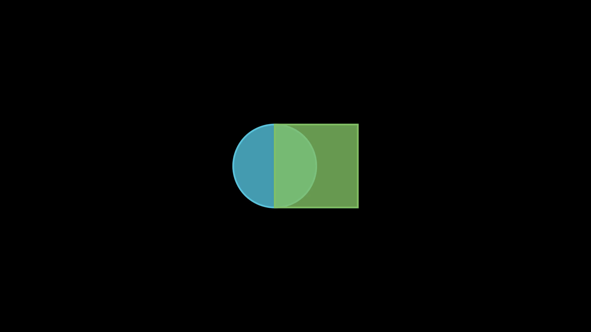

## Scene元素管理

### 主要函数

| 函数 | 作用描述 | 链接 |
|:---:|:---:|:---:|
| add | 添加元素到背景中 | [Go](https://docs.manim.community/en/stable/reference/manim.scene.scene.Scene.html#manim.scene.scene.Scene.add) |
| add_foreground_mobject | 添加单个元素到前景中 | [Go](https://docs.manim.community/en/stable/reference/manim.scene.scene.Scene.html#manim.scene.scene.Scene.add_foreground_mobject) |
| add_foreground_mobjects | 添加多个元素到前景中 | [Go](https://docs.manim.community/en/stable/reference/manim.scene.scene.Scene.html#manim.scene.scene.Scene.add_foreground_mobjects) |
| remove_foreground_mobject | 从场景中删除单个元素 | [Go](https://docs.manim.community/en/stable/reference/manim.scene.scene.Scene.html#manim.scene.scene.Scene.remove_foreground_mobject) |
| remove_foreground_mobjects | 从场景中删除多个元素 | [Go](https://docs.manim.community/en/stable/reference/manim.scene.scene.Scene.html#manim.scene.scene.Scene.remove_foreground_mobjects) |
| get_top_level_mobjects | 递归获取所有元素（不包含其子元素） | [Go](https://docs.manim.community/en/stable/reference/manim.scene.scene.Scene.html#manim.scene.scene.Scene.get_top_level_mobjects) |
| get_mobject_family_members | 递归获取所有元素及其子元素 | [Go](https://docs.manim.community/en/stable/reference/manim.scene.scene.Scene.html#manim.scene.scene.Scene.get_mobject_family_members) |
| get_moving_mobjects | 获取场景中正在移动的元素 | [Go](https://docs.manim.community/en/stable/reference/manim.scene.scene.Scene.html#manim.scene.scene.Scene.get_moving_mobjects) |
| get_restructured_mobject_list | 获取两个元素列表的交集 | [Go](https://docs.manim.community/en/stable/reference/manim.scene.scene.Scene.html#manim.scene.scene.Scene.get_moving_mobjects) |
| remove | 从中删除元素 | [Go](https://docs.manim.community/en/stable/reference/manim.scene.scene.Scene.html#manim.scene.scene.Scene.remove) |
| clear | 清空场景 | [Go](https://docs.manim.community/en/stable/reference/manim.scene.scene.Scene.html#manim.scene.scene.Scene.clear) |

### 简单案例

```python
from manim import *

class SceneTest1(Scene):
    def construct(self):
        circle = Circle()
        # play会自动添加对象, 因此add函数可以省略
        # self.add(circle)
        self.play(Create(circle))
        # 暂停0.5秒
        self.pause(duration=0.5)
        # 删除元素
        self.remove(circle)
        # 再次播放
        self.play(Create(circle))
        # 清空场景
        self.clear()
        # 等待0.5秒
        self.wait(duration=0.5)
```



---

## 详细介绍

在 Manim 中，`Scene` 使用 **层次结构和集合** 来管理场景中的 `Mobject`，使得用户能够灵活地添加、移除和操控动画元素。这种管理方式主要依赖以下几个核心概念：

---

## 核心管理机制

### 1. **`Mobject` 的层次结构**
`Mobject` 是所有对象的基类。Manim 允许 `Mobject` 嵌套，形成父子关系。这种嵌套结构使得复杂的对象可以由简单对象组成。

- **父子关系**：
  - 父 `Mobject` 可以包含多个子 `Mobject`，例如 `VGroup`。
  - 对父 `Mobject` 的变换会影响所有子 `Mobject`。

```python
circle = Circle()
square = Square()
group = VGroup(circle, square)  # 创建一个组
group.shift(UP)  # 组内所有元素都会向上移动
```

---

### 2. **场景中的顶级 `Mobject`**
Manim 使用一个列表（`Scene.mobjects`）来管理场景中所有的顶级 `Mobject`。
- 顶级 `Mobject` 是直接添加到场景中的对象。
- 子对象不在 `Scene.mobjects` 中直接维护，而是通过递归访问顶级对象获取。

```python
circle = Circle()
square = Square()
self.add(circle, square)  # 两个对象都是顶级 Mobject
```

---

### 3. **方法管理 `Mobject`**
Manim 提供了丰富的方法来操作场景中的 `Mobject`：

#### 添加
- **`add`**：将 `Mobject` 添加到场景。
  - 添加时，`Mobject` 会被插入到 `Scene.mobjects` 中。
```python
self.add(mobject1, mobject2)
```

#### 移除
- **`remove`**：从场景中移除一个或多个 `Mobject`。
  - 被移除的对象及其子对象不会再被渲染。
```python
self.remove(mobject1)
```

#### 清空
- **`clear`**：清空场景中所有的顶级 `Mobject`。
```python
self.clear()
```

---

### 4. **递归操作**
Manim 允许通过递归操作所有的子对象，以下函数是关键：

#### `get_top_level_mobjects`
- 返回场景中所有顶级对象，不包括子对象。
```python
top_level = self.get_top_level_mobjects()
print(top_level)  # 仅显示顶级对象
```

#### `get_mobject_family_members`
- 递归获取一个 `Mobject` 及其所有子对象。
```python
family = mobject.get_mobject_family_members()
print(family)  # 包括子对象
```

---

### 5. **前景与背景管理**
场景中的 `Mobject` 有分层控制：
- **前景**：
  - 使用 `add_foreground_mobject` 或 `add_foreground_mobjects` 将对象固定到前景层。
  - 前景对象会覆盖所有背景对象。
```python
self.add_foreground_mobject(mobject1)
```
- **背景**：
  - 默认添加的对象都在背景层，前景对象优先渲染。

---

### 6. **动态更新**
Manim 的 `Scene` 提供了实时更新机制：
- **`Scene.play`** 执行动画，同时更新场景。
- **`Scene.wait`** 保持当前状态，暂停一段时间。

```python
circle = Circle()
self.add(circle)
self.play(circle.animate.shift(UP))  # 动态更新，圆向上移动
```
---

## 总结

Manim 的 `Scene` 通过以下方式管理 `Mobject`：
1. **层次结构**：使用父子关系构建复杂对象。
2. **顶级对象列表**：维护所有直接添加到场景中的对象。
3. **递归操作**：支持对子对象和家族成员的操作。
4. **分层渲染**：通过前景和背景机制控制渲染顺序。

这种灵活的管理机制使得 Manim 能够高效处理复杂动画场景，同时保持用户友好的 API。

### Github链接

[Github - Manim-Teach](https://github.com/caoaolong/manim-teach.git)